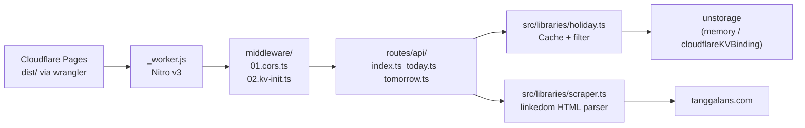
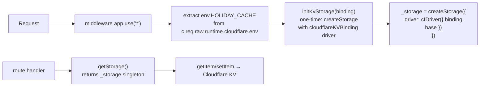

# AGENTS.md — api-hari-libur

## Architecture



## Key Files

| File | What it does | Agent notes |
|------|-------------|-------------|
| `routes/api/index.ts` | `GET /api` — Zod validation via `utils/validation.ts` | `defineHandler` from nitro |
| `routes/api/today.ts` | `GET /api/today` | Returns today's holidays |
| `routes/api/tomorrow.ts` | `GET /api/tomorrow` | Returns tomorrow's holidays |
| `middleware/01.cors.ts` | CORS headers via h3 `handleCors` | Preflight + regular handling |
| `middleware/02.kv-init.ts` | KV storage init with binding object | Extracts binding from `event.req.runtime.cloudflare.env` |
| `utils/validation.ts` | Zod → H3Error(422) wrapper | `zValidator(schema, data)` |
| `src/libraries/holiday.ts` | Business logic + unstorage cache | `initKvStorage(binding)` for KV |
| `src/libraries/scraper.ts` | HTML scraper | linkedom, uses `node:html` |
| `nitro.config.ts` | Nitro config | `scanDirs: ['.']` + `cloudflare_pages` preset |
| `wrangler.toml` | Wrangler config | KV namespace `HOLIDAY_CACHE` |

## Commands

| Command | Action |
|---------|--------|
| `pnpm dev` | Vite dev server (Nitro + HMR) on :3000 — uses memory driver |
| `pnpm build` | Production build → `dist/` |
| `pnpm test` | Vitest — 49 tests |
| `pnpm deploy` | `wrangler pages deploy` → CF Pages |
| `pnpm preview` | Preview build locally |

## Vite+/Nitro Best Practices (For Agents)

### Config

```ts
// vite.config.ts — KEEP THIS
import { defineConfig } from 'vite'
import { nitro } from 'nitro/vite'

export default defineConfig({
  plugins: [nitro({ preset: 'cloudflare_pages' })],
  resolve: { alias: { '@': '/src' } },
})
```

```ts
// nitro.config.ts — KEEP THIS
import { defineConfig } from 'nitro'
export default defineConfig({
  compatibilityDate: '2025-04-01',
  preset: 'cloudflare_pages',
  cloudflare: { nodeCompat: true },
  alias: { '@': '/src' },
  // Production: cloudflare KV binding
  storage: {
    holidays: {
      driver: 'cloudflareKVBinding',
      binding: 'HOLIDAY_CACHE',
    },
  },
  // Dev: memory fallback
  devStorage: {
    holidays: {
      driver: 'memory',
    },
  },
})
```

### Do NOT

- ❌ Set `serverEntry` in vite.config.ts — Nitro auto-detects `server.ts`
- ❌ Set `serverDir` in nitro.config.ts — `server.ts` IS the entry
- ❌ Use top-level `new Date()` — build cache freezes it (use function!)
- ❌ Install `vitest` separately — it's bundled with Vite+; use `test:` block in vite.config.ts
- ❌ Use `.output/public/` — Nitro v3 outputs to `dist/`

### Do

- ✅ Always check `pnpm-workspace.yaml` has `allowBuilds` for `esbuild`, `workerd`, `sharp`
- ✅ Use unique years per test (unstorage memory cache persists across tests)
- ✅ For linkedom: `nodeCompat: true` in nitro.config.ts
- ✅ Build check: `pnpm build && ls dist/_worker.js`
- ✅ Type check: `npx tsc --noEmit` before commit

## unstorage Integration (Done ✅)

Holiday cache uses **`unstorage` with Cloudflare KV** in production and **memory** in dev/tests.

### Architecture



### Initialization Flow

```
Worker boots → import holiday.ts
  → _storage = null (lazy)
  → First request arrives
    → Middleware: c.req.raw.runtime.cloudflare.env
      → env.HOLIDAY_CACHE exists?
        → YES: initKvStorage(binding OBJECT)
          → createStorage({ driver: cfDriver({ binding, base: 'api-hari-libur:' }) })
          → _storage = KV-backed storage (one-time)
        → NO (dev/test): getStorage() → memoryDriver()
    → Route handler: getHoliday(year)
      → getStorage() → _storage.getItem(year)
        → KV: getKVBinding → uses binding OBJECT → works! ✅
        → Memory: built-in driver → works! ✅
```

### Key Design Decisions

| Aspect | Detail |
|--------|--------|
| **Binding access** | `c.req.raw.runtime.cloudflare.env.HOLIDAY_CACHE` — within event lifecycle ✅ |
| **Driver init** | `initKvStorage(binding)` passes binding OBJECT (not string name) |
| **Why not string binding?** | `cloudflareKVBinding` driver with string tries `globalThis.__env__[name]` which only works in Nitro's `scheduled` handler, not `fetch` |
| **Why not useStorage config?** | Nitro storage config mounts driver with string name — same `globalThis.__env__` issue |
| **Prefix** | `base: 'api-hari-libur:'` — clean KV keys |
| **TTL** | Current year: 30 days (seconds). Past years: permanent. |
| **Dev** | `initKvStorage` never called (no binding) → memory fallback |
| **Tests** | Dynamic import fails → memory fallback in `getStorage()` |

### Code

```ts
// src/libraries/holiday.ts — KV init with binding object
export async function initKvStorage(binding: any) {
  if (_storage) return
  const { default: cfDriver } = await import('unstorage/drivers/cloudflare-kv-binding')
  _storage = createStorage({
    driver: cfDriver({ binding, base: 'api-hari-libur:' }),
  })
}

function getStorage(): Storage {
  if (!_storage) _storage = createStorage({ driver: memoryDriver() })
  return _storage
}
```

```ts
// src/app.ts — middleware (follows event lifecycle)
app.use('*', async (c, next) => {
  const env = (c.req.raw as any).runtime?.cloudflare?.env
  if (env?.HOLIDAY_CACHE) {
    await initKvStorage(env.HOLIDAY_CACHE)
  }
  await next()
})
```

## CI Pipeline (`.github/workflows/ci.yml`)

```yaml
steps:
  - pnpm/action-setup@v4
  - actions/setup-node@v4 (cache: pnpm)
  - pnpm install
  - npx tsc --noEmit    # type check
  - pnpm test           # vitest (49 tests)
  - pnpm build          # vite build (Nitro + Rolldown)
```

## Testing Notes

- `api.test.ts`: mocks `globalThis.fetch` via `vi.stubGlobal()`
- `holiday.test.ts`: mocks `crawler` via `vi.mock()`
- All tests must use **unique years** (unstorage memory cache persists across tests)
- Vitest config lives in `vite.config.ts` — no separate vitest config file
- Cache tests verify that `storage.getItem` returns cached data (async, works with unstorage)

## Deployment

`pnpm deploy` → wrangler reads `wrangler.toml` → `pages_build_output_dir = "dist"` → uploads to Cloudflare Pages.

KV namespace `HOLIDAY_CACHE` (id: `670c1bf9959b404f8c2650668969f74c`) — created via `wrangler kv namespace create`.

Production URL: https://api-hari-libur.pages.dev
Preview URL format: `https://{hash}.api-hari-libur.pages.dev`
