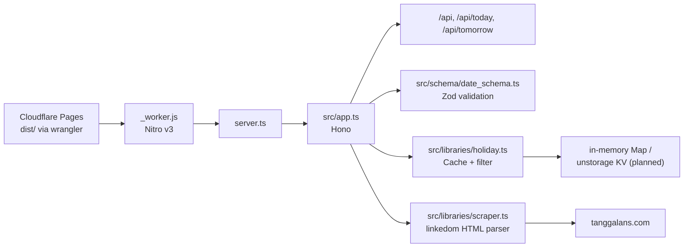

# AGENTS.md — api-hari-libur

## Architecture



## Key Files

| File | What it does | Agent notes |
|------|-------------|-------------|
| `server.ts` | Nitro entry — re-exports Hono app | Nitro auto-detects this at root |
| `vite.config.ts` | Vite config with Nitro plugin | `preset: cloudflare_pages` |
| `nitro.config.ts` | Nitro config | `nodeCompat: true` for linkedom |
| `src/app.ts` | Hono app (3 routes) | CORS + error handler included |
| `src/schema/date_schema.ts` | Zod schema | `getMaxYear()` MUST be a function (build freeze) |
| `src/libraries/holiday.ts` | Business logic + cache | In-memory Map, unique years per test |
| `src/libraries/scraper.ts` | HTML scraper | linkedom, uses `node:html` |
| `dist/` | Build output | Nitro generates `_worker.js` + static assets |

## Commands

| Command | Action |
|---------|--------|
| `pnpm dev` | Vite dev server (Nitro + HMR) on :3000 |
| `pnpm build` | Production build → `dist/` |
| `pnpm test` | Vitest — 49 tests |
| `pnpm deploy` | `wrangler pages deploy` → CF Pages |
| `pnpm preview` | Preview build locally |
| `vp dev` | Vite+ CLI (native binding issue on this VPS) |

## Vite+/Nitro Best Practices (For Agents)

### Config

```ts
// vite.config.ts — KEEP THIS
import { defineConfig } from 'vite'
import { nitro } from 'nitro/vite'

export default defineConfig({
  plugins: [nitro({ preset: 'cloudflare_pages' })],
  resolve: { alias: { '@': '/src' } },
})
```

```ts
// nitro.config.ts — KEEP THIS
import { defineConfig } from 'nitro'
export default defineConfig({
  compatibilityDate: '2025-04-01',
  preset: 'cloudflare_pages',
  cloudflare: { nodeCompat: true },
  alias: { '@': '/src' },
})
```

### Do NOT

- ❌ Set `serverEntry` in vite.config.ts — Nitro auto-detects `server.ts`
- ❌ Set `serverDir` in nitro.config.ts — `server.ts` IS the entry
- ❌ Use top-level `new Date()` — build cache freezes it (use function!)
- ❌ Install `vitest` separately — it's bundled with Vite+; use `test:` block in vite.config.ts
- ❌ Use `.output/public/` — Nitro v3 outputs to `dist/`

### Do

- ✅ Always check `pnpm-workspace.yaml` has `allowBuilds` for `esbuild`, `workerd`, `sharp`
- ✅ Use unique years per test (module-level cache persists across tests)
- ✅ For linkedom: `nodeCompat: true` in nitro.config.ts
- ✅ Build check: `pnpm build && ls dist/_worker.js`
- ✅ Type check: `npx tsc --noEmit` before commit

## unstorage Integration (Planned)

Replace `holiday.ts` in-memory `Map` with unstorage:

```ts
import { createStorage } from 'unstorage'
import cloudflareKVBinding from 'unstorage/drivers/cloudflare-kv-binding'
import memoryDriver from 'unstorage/drivers/memory'

export const storage = createStorage({
  driver: import.meta.dev
    ? memoryDriver()
    : cloudflareKVBinding({ binding: 'HOLIDAY_CACHE' }),
})
```

Steps:
1. `pnpm add unstorage`
2. Create KV namespace in CF dashboard (e.g. `api-hari-libur-cache`)
3. Add binding to `wrangler.toml`
4. Create `.dev.vars` with `HOLIDAY_CACHE=local` for dev
5. Replace `new Map()` calls with `storage.getItem`/`storage.setItem`

## CI Pipeline (`.github/workflows/ci.yml`)

```yaml
steps:
  - pnpm/action-setup@v4
  - actions/setup-node@v4 (cache: pnpm)
  - pnpm install
  - npx tsc --noEmit    # type check
  - pnpm test           # vitest (49 tests)
  - pnpm build          # vite build (Nitro + Rolldown)
```

## Testing Notes

- `api.test.ts`: mocks `globalThis.fetch` via `vi.stubGlobal()`
- `holiday.test.ts`: mocks `crawler` via `vi.mock()`
- All tests must use **unique years** (cache pollution)
- Vitest config lives in `vite.config.ts` — no separate vitest config file
- Test timeout: 10s (enough for mocked tests)

## Deployment

`pnpm deploy` → wrangler reads `wrangler.toml` → `pages_build_output_dir = "dist"` → uploads to Cloudflare Pages.

Production URL: https://api-hari-libur.pages.dev
Preview URL format: `https://{hash}.api-hari-libur.pages.dev`
