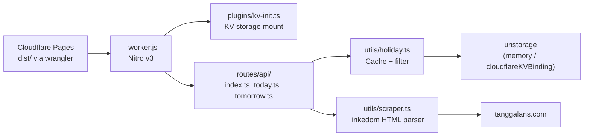

# AGENTS.md — api-hari-libur

## Architecture



## Project Structure

```
api-hari-libur/
├── .github/workflows/
│   └── ci.yml                  # CI: pnpm test → pnpm build
├── plugins/
│   └── kv-init.ts              # Nitro plugin — KV storage mount via globalThis
├── public/                     # Static assets (served at /)
│   ├── index.html              # Landing page + Try It Live
│   ├── script.js               # Landing page interactivity
│   ├── style.css               # Landing page styles
│   └── favicon.ico
├── routes/api/
│   ├── index.ts                # GET /api — year, month, day query
│   ├── today.ts                # GET /api/today
│   └── tomorrow.ts             # GET /api/tomorrow
├── test/
│   ├── api.test.ts             # Integration tests (mocked fetch)
│   ├── constants.test.ts       # Month name mapping tests
│   ├── date_schema.test.ts     # Zod schema validation tests
│   └── holiday.test.ts         # Business logic tests (mocked scraper)
├── utils/
│   ├── constants.ts            # MONTH_NAME: Indonesian month → number
│   ├── date_schema.ts          # Zod schema — dynamic getMaxYear()
│   ├── holiday.ts              # Business logic: unstorage cache + filter
│   ├── scraper.ts              # HTML scraper (linkedom → tanggalans.com)
│   └── validation.ts           # Zod → H3Error(422) wrapper
├── nitro.config.ts             # Nitro config: plugins, routeRules, imports
├── vite.config.ts              # Vite + Nitro plugin
├── wrangler.toml               # Cloudflare Pages config + KV binding
├── tsconfig.json
├── pnpm-workspace.yaml         # pnpm allowBuilds
├── package.json
└── .dev.vars                   # Local secrets (gitignored)
```

## Key Files

| File | Purpose | Notes |
|------|---------|-------|
| `plugins/kv-init.ts` | KV storage init | Nitro plugin, mounts on first request |
| `routes/api/index.ts` | `GET /api` | Zod validation, year/month/day params |
| `routes/api/today.ts` | `GET /api/today` | Asia/Jakarta timezone |
| `routes/api/tomorrow.ts` | `GET /api/tomorrow` | +1 day from today |
| `utils/holiday.ts` | Business logic | Cache read/write + scraper fallback |
| `utils/scraper.ts` | HTML scraper | AbortSignal.timeout(10s), 512KB cap |
| `utils/validation.ts` | Zod wrapper | Throws H3Error 422 on validation fail |
| `utils/date_schema.ts` | Zod schema | `getMaxYear()` — not top-level `new Date()` |
| `utils/constants.ts` | Month mapping | Indonesian → `'01'`–`'12'` |
| `nitro.config.ts` | Nitro config | routeRules, scanDirs, imports.exclude |

## Commands

| Command | Action |
|---------|--------|
| `pnpm dev` | Vite dev server on :3000 — memory driver |
| `pnpm test` | Vitest — 48 tests |
| `pnpm build` | Production build → `dist/` |
| `pnpm deploy` | `wrangler pages deploy` → CF Pages |
| `pnpm preview` | Preview build locally |

## Config Files

### nitro.config.ts

```ts
import { defineConfig } from 'nitro'
export default defineConfig({
  compatibilityDate: '2025-04-01',
  preset: 'cloudflare_pages',
  plugins: ['./plugins/kv-init.ts'],
  scanDirs: ['routes'],
  imports: {
    dirs: ['utils'],
    exclude: [/useStorage/],  // avoid Rolldown naming collision
  },
  routeRules: {
    '/api/**': {
      cors: true,
      headers: {
        'Access-Control-Allow-Methods': 'GET',
        'Access-Control-Allow-Headers': 'Accept, Content-Type',
        'Cache-Control': 'public, max-age=300, s-maxage=3600',
      },
    },
  },
  rollupConfig: { output: { inlineDynamicImports: true } },
  cloudflare: { nodeCompat: true },
})
```

### vite.config.ts

```ts
import { defineConfig } from 'vite'
import { nitro } from 'nitro/vite'

export default defineConfig({
  plugins: [nitro({ preset: 'cloudflare_pages' })],
})
```

### wrangler.toml

```toml
name = "api-hari-libur"
compatibility_date = "2025-01-01"
pages_build_output_dir = "dist"

[[kv_namespaces]]
binding = "HOLIDAY_CACHE"
id = "670c1bf9959b404f8c2650668969f74c"
```

## KV Storage Integration

Holiday cache uses **unstorage with Cloudflare KV** in production and **memory** in dev/tests.

### Initialization Flow

```
Worker boots → Plugin loaded via #nitro/virtual/plugins
  → First request arrives → Plugin request hook fires
    → env.HOLIDAY_CACHE exists?
      → YES: useStorage().mount("holidays", cfDriver({ binding, base: 'api-hari-libur:' }))
        → globalThis.__holidayStorage = useStorage("holidays")
      → NO (dev/test): no mount → memory fallback
  → Route handler → getStorage() → globalThis.__holidayStorage || memoryDriver()
```

### useStorage Collision (Rolldown)

**Problem:** `useStorage` from explicit import (`nitro/storage`) and auto-imported `useStorage` resolve to different module paths → Rolldown renames one to `useStorage$1`.

**Fix:**
1. `nitro.config.ts`: `imports.exclude: [/useStorage/]`
2. `plugins/kv-init.ts`: explicit `import { useStorage } from "nitro/storage"`
3. `utils/holiday.ts`: reads from `globalThis.__holidayStorage` (no `useStorage` import)

### Key Design Decisions

| Decision | Why |
|----------|-----|
| Plugin-based KV init | `useStorage` config uses string binding → fails in `fetch` handler |
| `globalThis.__holidayStorage` | Avoids import collision, works in Vitest (memory fallback) |
| `base: 'api-hari-libur:'` | Clean KV keys, no namespace collision |
| `AbortSignal.timeout(10s)` | Prevents scraper from blocking worker |
| 512KB response cap | Protects 128MB memory limit |
| `nodeCompat: true` | Required for linkedom |

## Route Rules (CORS + Cache)

CORS and cache headers handled via `routeRules` — no middleware needed:

```ts
routeRules: {
  '/api/**': {
    cors: true,
    headers: {
      'Access-Control-Allow-Methods': 'GET',
      'Access-Control-Allow-Headers': 'Accept, Content-Type',
      'Cache-Control': 'public, max-age=300, s-maxage=3600',
    },
  },
}
```

Historical data overrides in route handler: `s-maxage=2592000, immutable` (30 days).

## CI Pipeline

```yaml
# .github/workflows/ci.yml
steps:
  - pnpm/action-setup@v4          # reads packageManager field
  - actions/setup-node@v4 (cache: pnpm)
  - pnpm install
  - pnpm test                     # vitest — 48 tests
  - pnpm build                    # vite build (Nitro + Rolldown)
```

Note: `tsc --noEmit` removed — Nitro v3 beta doesn't generate standalone `.d.ts` files. Build + tests validate correctness.

## Testing Notes

- `api.test.ts`: mocks `globalThis.fetch` via `vi.stubGlobal()`
- `holiday.test.ts`: mocks `crawler` via `vi.mock()`
- All tests use **unique years** (unstorage memory cache persists across tests)
- Vitest config in `vite.config.ts` — no separate vitest config
- `nitro/storage` is virtual module — NOT available in Vitest, always use memory fallback

## Pitfalls

- ❌ Top-level `new Date()` — build cache freezes it (use function)
- ❌ `serverEntry` in vite.config.ts — Nitro auto-detects `server.ts`
- ❌ `.output/public/` — Nitro v3 outputs to `dist/`
- ❌ `initKvStorage()` — removed, plugin handles KV init
- ❌ Separate `vitest` install — bundled with Vite+, use `test:` block
- ❌ `version: latest` in `pnpm/action-setup@v4` — reads from `packageManager` field instead

## Deployment

`pnpm deploy` → wrangler reads `wrangler.toml` → uploads `dist/` to Cloudflare Pages.

KV namespace: `HOLIDAY_CACHE` (id: `670c1bf9959b404f8c2650668969f74c`)

Production: https://api-hari-libur.pages.dev
