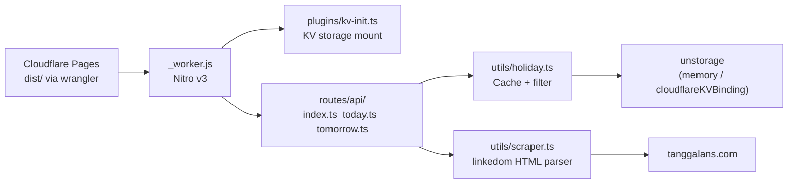
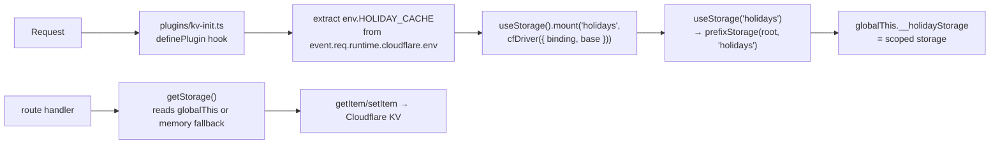

# AGENTS.md — api-hari-libur

## Architecture



## Key Files

| File | What it does | Agent notes |
|------|-------------|-------------|
| `plugins/kv-init.ts` | KV storage init via `useStorage().mount()` | Explicit imports `definePlugin` + `useStorage` from nitro |
| `routes/api/index.ts` | `GET /api` — Zod validation via `utils/validation.ts` | `defineHandler` from nitro |
| `routes/api/today.ts` | `GET /api/today` | Returns today's holidays |
| `routes/api/tomorrow.ts` | `GET /api/tomorrow` | Returns tomorrow's holidays |
| `utils/validation.ts` | Zod → H3Error(422) wrapper | `zValidator(schema, data)` |
| `utils/holiday.ts` | Business logic + unstorage cache | Reads from `globalThis.__holidayStorage` |
| `utils/scraper.ts` | HTML scraper | linkedom, parses tanggalans.com |
| `utils/constants.ts` | Month name mapping | `MONTH_NAME` object |
| `nitro.config.ts` | Nitro config | `scanDirs: ['routes', 'middleware', 'utils']` |
| `wrangler.toml` | Wrangler config | KV namespace `HOLIDAY_CACHE` |

## Commands

| Command | Action |
|---------|--------|
| `pnpm dev` | Vite dev server (Nitro + HMR) on :3000 — uses memory driver |
| `pnpm build` | Production build → `dist/` |
| `pnpm test` | Vitest — 96 tests |
| `pnpm deploy` | `wrangler pages deploy` → CF Pages |
| `pnpm preview` | Preview build locally |

## Vite+/Nitro Best Practices (For Agents)

### Config

```ts
// vite.config.ts — KEEP THIS
import { defineConfig } from 'vite'
import { nitro } from 'nitro/vite'

export default defineConfig({
  plugins: [nitro({ preset: 'cloudflare_pages' })],
  resolve: { alias: { '@': '/src' } },
  test: {
    // Vitest config lives here — no separate vitest.config.ts
  }
})
```

```ts
// nitro.config.ts — KEEP THIS
import { defineConfig } from 'nitro'
export default defineConfig({
  compatibilityDate: '2025-04-01',
  preset: 'cloudflare_pages',
  plugins: ['./plugins/kv-init.ts'],
  scanDirs: ['routes'],
  imports: {
    dirs: ['utils'],
    exclude: [/useStorage/],  // see "useStorage collision" section below
  },
  routeRules: {
    '/api/**': {
      cors: true,
      headers: {
        'Access-Control-Allow-Methods': 'GET',
        'Access-Control-Allow-Headers': 'Accept, Content-Type',
        'Cache-Control': 'public, max-age=300, s-maxage=3600',
      },
    },
  },
  rollupConfig: {
    output: { inlineDynamicImports: true },
  },
  cloudflare: { nodeCompat: true },
})
```

### Do NOT

- ❌ Set `serverEntry` in vite.config.ts — Nitro auto-detects `server.ts`
- ❌ Set `serverDir` in nitro.config.ts — `server.ts` IS the entry
- ❌ Use top-level `new Date()` — build cache freezes it (use function!)
- ❌ Install `vitest` separately — it's bundled with Vite+; use `test:` block in vite.config.ts
- ❌ Use `.output/public/` — Nitro v3 outputs to `dist/`
- ❌ Use `initKvStorage()` — removed, plugin handles KV init now

### Do

- ✅ Always check `pnpm-workspace.yaml` has `allowBuilds` for `esbuild`, `workerd`, `sharp`
- ✅ Use unique years per test (unstorage memory cache persists across tests)
- ✅ For linkedom: `nodeCompat: true` in nitro.config.ts
- ✅ Build check: `pnpm build && ls dist/_worker.js`
- ✅ Type check: `npx tsc --noEmit` before commit

## KV Storage Integration (Done ✅)

Holiday cache uses **`unstorage` with Cloudflare KV** in production and **memory** in dev/tests.

### Architecture



### Initialization Flow

```
Worker boots
  → Plugin loaded via #nitro/virtual/plugins
  → First request arrives
    → Plugin request hook fires
      → env.HOLIDAY_CACHE exists?
        → YES: useStorage().mount("holidays", cfDriver({ binding, base: 'api-hari-libur:' }))
          → useStorage("holidays") → scoped storage
          → globalThis.__holidayStorage = scoped storage
        → NO (dev/test): no mount, no globalThis set
    → Route handler: getHoliday(year)
      → getStorage() → globalThis.__holidayStorage || memoryDriver()
      → storage.getItem(year)
        → KV: mounted driver → Cloudflare KV key "api-hari-libur:<year>" ✅
        → Memory: built-in driver → works ✅
```

### useStorage Collision (Rolldown)

**Problem:** `useStorage` from explicit import (`nitro/storage`) and auto-imported `useStorage` resolve to different module paths in Rolldown pipeline → Rolldown renames one to `useStorage$1`.

**Fix:**
1. `nitro.config.ts`: `imports.exclude: [/useStorage/]` — prevents auto-injection
2. `plugins/kv-init.ts`: explicit `import { useStorage } from "nitro/storage"`
3. `utils/holiday.ts`: reads from `globalThis.__holidayStorage` (no `useStorage` import needed — virtual module doesn't resolve in Vitest)

### Key Design Decisions

| Aspect | Detail |
|--------|--------|
| **Binding access** | `event.req.runtime.cloudflare.env.HOLIDAY_CACHE` — within event lifecycle ✅ |
| **Driver init** | Plugin: `useStorage().mount("holidays", cfDriver({ binding }))` — passes binding OBJECT |
| **Why not string binding?** | `cloudflareKVBinding` driver with string tries `globalThis.__env__[name]` — only works in `scheduled` handler, not `fetch` |
| **Why not useStorage config?** | Nitro storage config uses string binding — same `globalThis.__env__` issue |
| **Why explicit imports in plugin?** | Plugin files bypass auto-import (not in scanDirs). Virtual module `#nitro/virtual/plugins` strips injected imports during bundling |
| **Prefix** | `base: 'api-hari-libur:'` — clean KV keys |
| **TTL** | Current year: 30 days. Past years: permanent. |
| **Dev** | Plugin hook fires but no binding → no mount → memory fallback |
| **Tests** | `globalThis.__holidayStorage` not set → `getStorage()` → memoryDriver() |

### Code

```ts
// plugins/kv-init.ts — KV init via Nitro plugin
import { definePlugin } from "nitro";
import { useStorage } from "nitro/storage";
import cfDriver from "unstorage/drivers/cloudflare-kv-binding";

export default definePlugin((nitroApp) => {
  nitroApp.hooks.hook("request", (event) => {
    if ((globalThis as any).__holidayStorage) return;
    const env = event.req?.runtime?.cloudflare?.env;
    const binding = env?.HOLIDAY_CACHE;
    if (binding) {
      const storage = useStorage();
      storage.mount("holidays", cfDriver({ binding, base: "api-hari-libur:" }));
      (globalThis as any).__holidayStorage = useStorage("holidays");
    }
  });
});
```

```ts
// utils/holiday.ts — storage accessor
function getStorage(): Storage {
  if (_storage) return _storage;
  const kvStorage = (globalThis as any).__holidayStorage;
  if (kvStorage) { _storage = kvStorage; return _storage; }
  _storage = createStorage({ driver: memoryDriver() });  // dev/tests
  return _storage;
}
```

## CI Pipeline (`.github/workflows/ci.yml`)

```yaml
steps:
  - pnpm/action-setup@v4
  - actions/setup-node@v4 (cache: pnpm)
  - pnpm install
  - npx tsc --noEmit    # type check
  - pnpm test           # vitest (96 tests)
  - pnpm build          # vite build (Nitro + Rolldown)
```

## Testing Notes

- `api.test.ts`: mocks `globalThis.fetch` via `vi.stubGlobal()`
- `holiday.test.ts`: mocks `crawler` via `vi.mock()`
- All tests must use **unique years** (unstorage memory cache persists across tests)
- Vitest config lives in `vite.config.ts` — no separate vitest config file
- Cache tests verify that `storage.getItem` returns cached data (async, works with unstorage)
- `nitro/storage` is a virtual module — NOT available in Vitest. Always use memory fallback in test paths.

## Deployment

`pnpm deploy` → wrangler reads `wrangler.toml` → `pages_build_output_dir = "dist"` → uploads to Cloudflare Pages.

KV namespace `HOLIDAY_CACHE` (id: `670c1bf9959b404f8c2650668969f74c`) — created via `wrangler kv namespace create`.

Production URL: https://api-hari-libur.pages.dev
Preview URL format: `https://{hash}.api-hari-libur.pages.dev`
